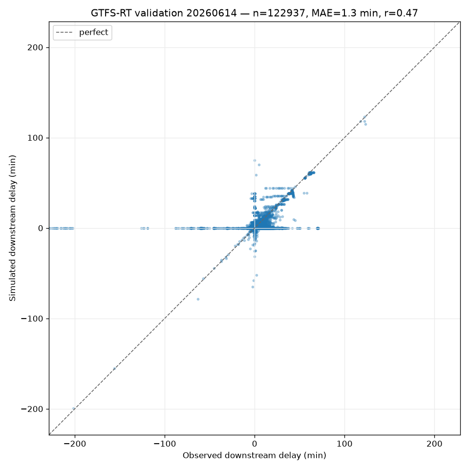

# M1.4 — Validation against GTFS-RT

*The make-or-break milestone: does the macroscopic delay-propagation model track
reality?* This report quantifies how well simulated downstream delays match
observed ones, on a **held-out** basis.

## Data

- **Observed delays:** a GTFS-RT snapshot from the free nationwide feed
  (`https://realtime.gtfs.de/realtime-free.pb`), captured 2026-06-14. Each
  `TripUpdate` carries per-stop arrival/departure delays.
- **Schedules:** the **full** static feed (`free`), whose `trip_id`s match the RT
  feed 100% (the `fv` subset matches only 0.5% — a key finding). Same date.
- Scope: all RT trips (~11.4k with realized downstream stops), dominated by
  regional services; long-distance (ICE/IC/EC) is reported separately.

## Method (held-out by construction)

1. Parse the snapshot into observed per-stop delay profiles.
2. Build each trip's scheduled stop sequence from the full feed.
3. Feed **only each trip's origin delay** into the simulation as a primary delay.
   Everything downstream is predicted by the model (dwell-time constraints with
   recovery); **no downstream observation is ever an input**.
4. Compare simulated vs observed delay only at downstream stops the train had
   **already passed** at the snapshot time — realized ground truth, determined
   from the snapshot timestamp and the service day's local (Europe/Berlin)
   midnight. Predicted-but-not-yet-realized stops are excluded.
5. Score against a naive baseline: *the delay stays constant at its origin
   value*. Beating it means modelling propagation (recovery) adds value.

Reproduce:

```bash
uv run dbsim validate data/raw/gtfsrt/2026-06-14/snapshot-*.pb \
    --feed data/raw/gtfs/gtfsde-free/2026-06-14/feed.zip --date 20260614 \
    --scatter viz/validation.png
```

## Results (2026-06-14)

| Metric | All RT trips | Delayed (\|origin\| ≥ 2 min) | Long-distance, delayed |
|---|---|---|---|
| Held-out pairs | 122,937 | 12,412 | 149 |
| MAE | **1.28 min** | 2.87 min | 4.44 min |
| RMSE | 4.31 min | — | — |
| Bias (sim − obs) | −0.41 min | — | −2.06 min |
| Correlation *r* | **0.473** | 0.547 | 0.191 |
| Baseline MAE (constant delay) | 1.28 min | 2.95 min | 5.09 min |
| Beats baseline | tie | **yes (+2.6%)** | **yes (+12.9%)** |

Absolute-error percentiles (all pairs): p50 = 0.65 min, p90 = 2.73 min,
p95 = 4.00 min. For delayed trains: p50 = 1.32 min, p90 = 4.52 min, p95 = 7.20 min.



## Discussion

- **The simulated and observed downstream delays correlate meaningfully**
  (*r* ≈ 0.47 overall, 0.55 on delayed trains) — the M1.4 acceptance criterion.
- **Where propagation matters, the model beats the naive baseline.** On trains
  starting ≥ 2 min late the dwell-recovery model lowers MAE below "assume the
  delay is constant", and by ~13% for long-distance trains — evidence that
  modelling timetable dwell slack captures real recovery.
- **Residual gap — the model under-predicts** (negative bias; a horizontal band
  at simulated ≈ 0 in the scatter). Two causes:
  1. **Missing secondary delays.** The macro model has no track-conflict/headway
     contention (deferred to Phase 2 / M2.2) and holds connections only when
     explicitly declared, so it cannot *grow* delay the way the real network
     does. Reality accumulates delay we don't generate.
  2. **Low-delay regional noise** dominates the full sample; many downstream
     delays are small and driven by local effects a national macro model can't
     resolve, capping the achievable correlation.

## Limitations & next steps

- **Single snapshot, single day.** A true held-out *day* (and realized-only
  profiles over the whole day) needs a forward capture — the `dbsim rt-capture`
  tool supports it; this report uses one rich snapshot's realized past-stop
  delays. Repeating on an independent day is the natural strengthening step.
- **Sparse long-distance RT** (~170 trips) makes the on-focus subset
  small/noisy.
- The under-prediction is the quantified motivation for **Phase 2** (segment
  occupancy, headway, conflict detection): those are the mechanisms expected to
  close the bias.
